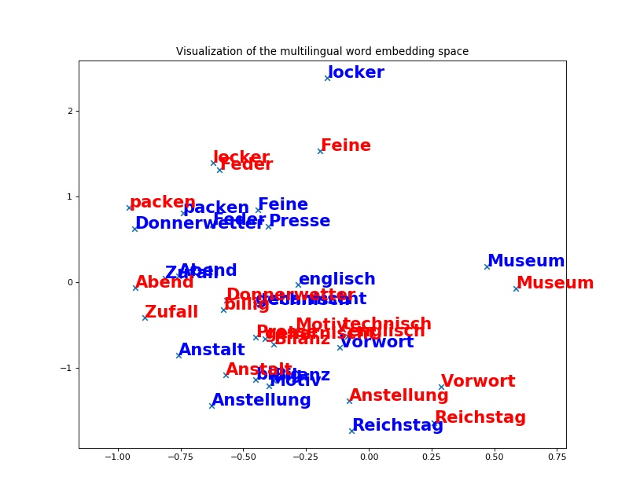

Pre-Req:
==================

Download and install using the instructions.

Fasttext: https://github.com/facebookresearch/fastText

MUSE: https://github.com/facebookresearch/MUSE

(If you want to skip the training part, download and unzip the pretrained embeddings and pretrained models frome here: https://drive.google.com/open?id=1goxYtiKsj-s4ax27L7sWefpyoDaw36TP )

Create Embedding:
=======================================

Create fasttext embeddings using dta18.txt (1800) and dta19.txt (1900), use fasttext_model.py

Allignment:
=======================================

pre-req: MUSE and monolingual and cross-lingual word embeddings evaluation datasets(See MUSE readme).

Supervised allignment: 
using a train bilingual dictionary (or identical character strings as anchor points), learn a mapping from the source to the target space using (iterative) Procrustes alignment.

Command:

    python3 MUSE/supervised.py --src_lang 17 --tgt_lang 18 --src_emb t1.bin --tgt_emb t2.bin --n_refinement 5 --dico_train dictionary.txt --cuda False --emb_dim 512 --dico_eval dictionary.txt

Unsupervised allignment: 
without any parallel data or anchor point, learn a mapping from the source to the target space using adversarial training and (iterative) Procrustes refinement.

Command:

    python3 MUSE/unsupervised.py --src_lang 17 --tgt_lang 18 --src_emb t1.bin --tgt_emb t2.bin --n_refinement 5 --cuda False --emb_dim 512 --dico_eval dictionary.txt

Visualization and distance calculation:
=======================================

Run     distance.py

        Anstalt	0.5013280902314663
        Anstellung	0.507780886911848
        Bilanz	0.5950476413659643
        billig	0.5644998547387627
        Donnerwetter	0.4577280999192952
        englisch	0.46238426270264255
        Feder	0.5277356027146054
        Feine	0.5720351157943221
        geharnischt	0.597379202524812
        locker	0.411954522526508
        Motiv	0.7712048689283667
        Museum	0.4408447676985502
        packen	0.44903838213647584
        Presse	0.6272148963016022
        Reichstag	0.36420825998625206
        technisch	0.6834874266214862
        Vorwort	0.7404966314316774
        Zufall	0.4843775604046865
        Abend	0.31869102668259386

Fig: Results visualization for Dimention 512 unsupervised alignment

