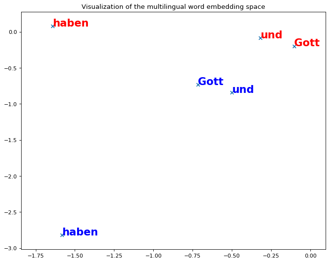

Pre-Req:
==================

Download and install using the instructions.

Fasttext: https://github.com/facebookresearch/fastText

MUSE: https://github.com/facebookresearch/MUSE

(If you want to skip the training part, unzip and use resources in d512supervised/ folder)

Preprocessing:
=======================================
Created two corpus of two time domain using corpus data, t1.txt (1700) and t2.txt (1800).

Create Embedding:
=======================================

Create fasttext embeddings using t1.txt and t2.txt, use embeddings/fasttext_model.py

Allignment:
=======================================

pre-req: MUSE and monolingual and cross-lingual word embeddings evaluation datasets(See MUSE readme).

Supervised allignment: 
using a train bilingual dictionary (or identical character strings as anchor points), learn a mapping from the source to the target space using (iterative) Procrustes alignment.

Command:

    python3 MUSE/supervised.py --src_lang 17 --tgt_lang 18 --src_emb t1.bin --tgt_emb t2.bin --n_refinement 5 --dico_train dictionary.txt --cuda False --emb_dim 512 --dico_eval dictionary.txt

Unsupervised allignment: 
without any parallel data or anchor point, learn a mapping from the source to the target space using adversarial training and (iterative) Procrustes refinement.

Command:

    python3 MUSE/unsupervised.py --src_lang 17 --tgt_lang 18 --src_emb t1.bin --tgt_emb t2.bin --n_refinement 5 --cuda False --emb_dim 512 --dico_eval dictionary.txt

Visualization and distance calculation:
=======================================

Run     SemanticChangeVisualization.ipynb

